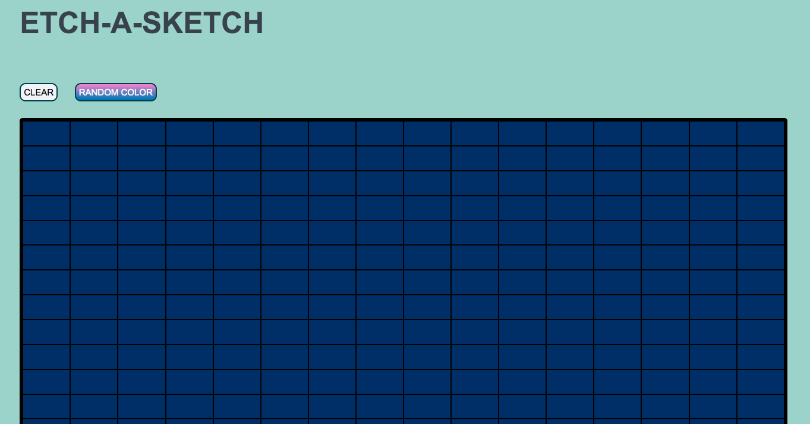

# Etch - A - Sketch

## General Information:
This project was complete following The Odin Project's [curriculum](https://www.theodinproject.com/courses/web-development-101/lessons/etch-a-sketch-project).
## Screenshot:

## Technologies:
- HTML
- CSS
- Vanilla Javascript

## Setup: 
The live version of the webpage can be seen [here](https://tpsst5.github.io/etch_a_sketch/).
## Status:
This project is complete.